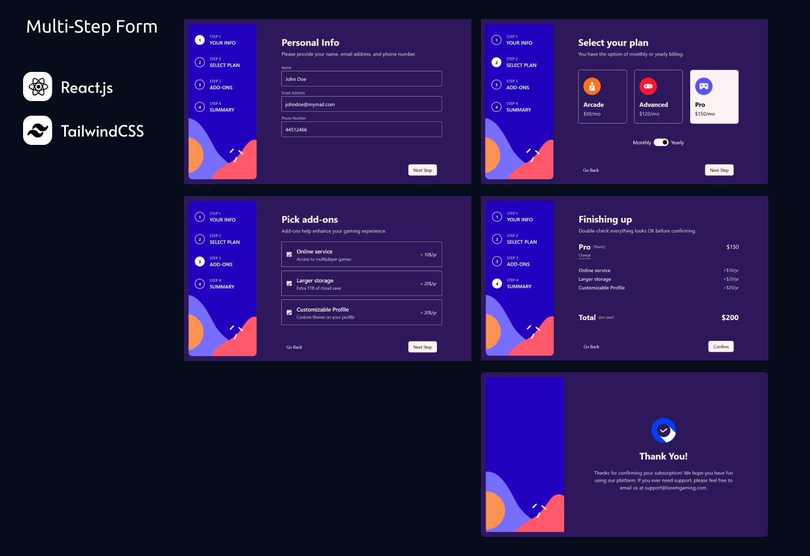

# Multi-Step Form

Simulated multi-step form following 4 total steps and a "Thank You" screen. Go through 
the process of inputting your information, selecting your plan, choosing addons and 
making sure everything is correct before submitting.

## Features

- Complete each step of the sequence
- Go back to a previous step to update your selections
- Navigate with both the buttons and the step navigation
- See a summary of your selections on the final step and confirm your order
- View the optimal layout for the interface depending on your device's screen size
- See hover and focus states for all interactive elements on the page
- Receive form validation messages if:
    - A field has been missed
    - The email address is not formatted correctly
    - A step is submitted, but no selection has been made

### Built With

- [React.js](https://react.dev/)
- [React Router](https://reactrouter.com/en/main) - for routing
- [TailwindCSS](https://tailwindcss.com/) - for styling
- [react-confetti-explosion](https://www.npmjs.com/package/react-confetti-explosion) - for a fun little surprise

### Challenge By

This [Challenge](https://www.frontendmentor.io/challenges/multistep-form-YVAnSdqQBJ) is taken from [FrontendMentor](https://www.frontendmentor.io/home)